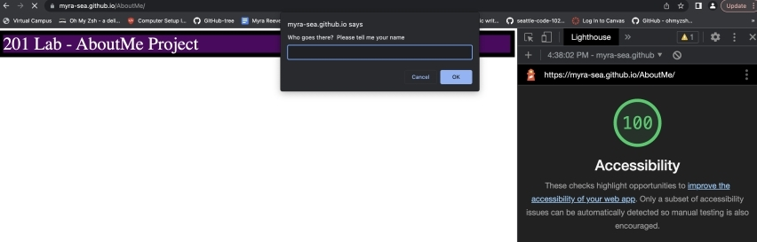
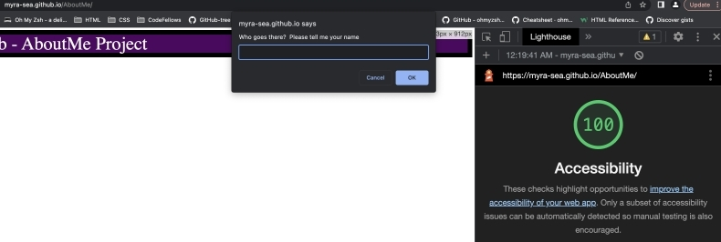

# AboutMe
201 project (starting with Lab 2 on 10/24/2023)

### 🦋 Author: Myra Reeves

## Project Name:  AboutMe Lab

Quoted instructions from the Lab 2 assignment on Canvas:
>Build out an “About Me” webpage that quizzes the user on fun facts gives the user some basic information about who you are and where you came from.
>
> 
>
>* Create an About Me guessing game that utilizes HTML, CSS, & JavaScript.
>* Include on your HTML page a short biography, your education history, an overview of your job experience, and any goals that you may have.
>* Prompt the user a total of exactly five yes or no questions. The user input for the answer must accept either y/n or yes/no responses while taking into consideration case sensitivity by normalizing the user input so that it can be validated (hint: look into the `.toUpperCase()` or `.toLowerCase()` functions). Be sure to let the user know if they answered the question correctly by alerting them with a response.
>* `Add console.log()` messages within your app to notify the user if they are correct. Before submitting, comment out (don’t delete) your `console.log()` messages and replace them with the `alerts()` to complete the project.
>
> 
>
>* Ask the user their name through a `prompt()`
>* Display that name back to the user through a custom greeting welcoming them to your site.
>* Display the user’s name back to them in your final message to the user.
>
> 
>
>### Developer Style Guide
>
>A style guide is a series of standards and practices that must be followed in order for your code to be accepted by the team. This can include variable naming, file structure, and process. Below is a list of practices that you will be required to follow within this lab:
>* Your JS file must contain a `'use strict'` declaration at the top, and your javascript file must be linked in your html file as an external script file.
>* Make sure that all code is cleanly written with correct indentation and syntax. Look at an example [JavaScript Style Guide](https://javascript.info/coding-style#syntax). Note that your JS must pass the rules in the linter that you installed.

 

 

Quoted instructions from the Lab 3 assignment on Canvas:

>Continue to build off of your lab 02 by adding additional functionality to your About Me Guessing Game. Work in the same repository as you did for Lab 2, and modify your README.md file to describe your project with the new features you are adding.
>
>As a user, I would like to view a series of data related to the site owners interest so that the I can quickly view more information about them. Create a “Top Ten” at the bottom of your HTML page as an ordered list in HTML. Some ideas that you can include could be top ten movies, top ten favorite places, or top ten places to visit. You may choose to do whatever top ten list that you wish. Convert your work experience and education summary into an unordered list using HTML
>
>As a user, I would like to be guided to an answer through a series of feedback responses so that I can learn more about the site owner. Add a 6th question to the guessing game that takes in a numeric input by prompting the user to guess a number. Indicates through an alert if the guess is “too high” or “too low”. It should give the user exactly four opportunities to get the correct answer. After all attempts have been exhausted, tell the user the correct answer. Consider using a loop of some sort.
>
>As a user, I would like to guess the answer to a question that could have many possibilities so that I can have fun with with a guessing game. Add a 7th question that has multiple possible correct answers that are stored in an array. Give the user 6 attempts to guess the correct answer. The guesses will end once the user guesses a correct answer or they run out of attempts. Display all the possible correct answers to the user. Consider using a loop of some sort for this question.
>
>As a user, I would like to know my final score so that I can know how well I did. Keep track of the total number of correct answers. At the end tell them how many they got correct out of the 7 questions asked.

~.~.~ Lab 4 still in progress. This area to be filled in after Lab 4 completion~.~.~

Quoted instructions from the Lab 5b assignment on Canvas:

>Deploy your app to GitHub Pages and add any additional final touches to your CSS. Run a Lighthouse report making sure your site scores between the 50-65 range and add a screenshot of your score to your README.md. 

### Links and Resources

* [Setting Up A New 201 Code Project](https://codefellows.github.io/code-201-guide/curriculum/class-02/project-setup)
* [CodeFellows provided linter code](https://github.com/codefellows/seattle-code-201d106/blob/main/configs/.eslintrc.json)
* [CodeFellows provided .gitignore code](https://github.com/codefellows/seattle-code-201d106/blob/main/configs/.gitignore)
* [Default 201 README template](https://codefellows.github.io/code-201-guide/curriculum/class-02/README-template.html)
* [JavaScript Style Guide.](https://javascript.info/coding-style#syntax)
* [Eric Meyer’s reset.css file ](https://meyerweb.com/eric/tools/css/reset/)

### Lighthouse Accessibility Report Score

* Lab 2 score = 100%  Woot!

* Lab 3 score = Still at 100%  Yeay!

* Lab 5b score = 100%

### Reflections and Comments

* Consider including the answers to your daily journal and submission questions here
* This is also a good place to reflect on the tools and resources used and learned
